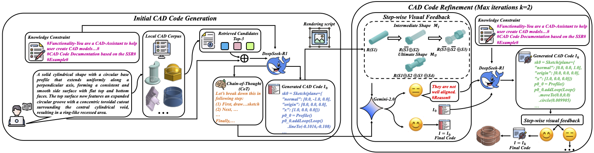
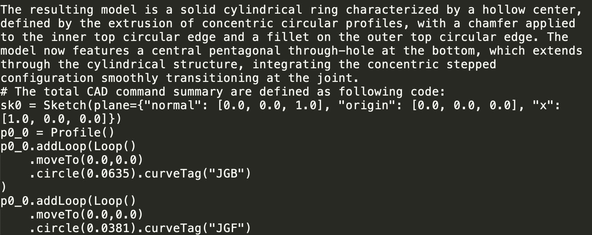

[](https://iclr.cc/)
# Seek-CAD : A Self-refined Generative Modeling for 3D Parametric CAD Using Local Inference via DeepSeek (ICLR 2026)

<p align="center">
  
</p>

## Dataset 

<p align="center">
  
</p>
<p align="center">
  
</p>
<p align="center">
  
</p>


### Seek-CAD Dataset

#### Dataset Overview

We provide the **Seek-CAD dataset**, which contains approximately **40,000 CAD models**.  
Each CAD model is primarily stored in **JSON format**.

The dataset supports a wide range of CAD operation types, including **sketch**, **extrude**, **revolve**, **fillet**, **chamfer**, and **shell**.  
Approximately **70%** of the CAD models contain **advanced operations**, such as **fillet**, **chamfer**, and **shell**, making the dataset suitable for studying complex and realistic CAD modeling scenarios.

#### Download Instructions

The JSON files can be downloaded from the following link: https://drive.google.com/file/d/1kO2wNm_JDBZfhgvsVqKSOWU_h2EbACGV/view?usp=sharing

We recommend downloading the file to the `Dataset/` directory and extracting it using:

```bash
unzip json_files.zip
```

#### Text Descriptions

For each CAD model, we also provide a corresponding **textual description**, which can be found at:

```
Dataset/descriptions.json
```

#### Visualization and Conversion Examples

We provide a detailed example script located at:

```
visualize/example/visualize_example.py
```

This script demonstrates:

- How to construct 3D CAD models from JSON files using APIs from OpenCascade (e.g., exporting models as STEP files)
- How to convert JSON files into a code-based representation
- How to regenerate a unified JSON format from code
- How to convert our data format into the JSON format required by [**DeepCAD**](https://github.com/rundiwu/DeepCAD), making data exchange convenient for users who rely on DeepCAD scripts.

These examples are intended to facilitate data visualization, format conversion, and integration with existing CAD learning pipelines.

### Pre-processed Text-SSR Pairs (RAG Corpus)

We provide 4 pre-processed `.txt` files containing over **23K** Text2SSR (Sketch, Sketchbased feature, and Refinements) pairs. You can access these files by unzipping the archive located at `Dataset/preprocessed_txt2ssr`.

- **Total Samples**: 23,313 pairs.
- **File Format**: `.txt` (Text-SSR pairs).

**File Breakdown:**

- `Text2SSR_part1.txt`: **5,199** samples
- `Text2SSR_part2.txt`: **6,825** samples
- `Text2SSR_part3.txt`: **6,275** samples
- `Text2SSR_part4.txt`: **5,014** samples
  
**Sample Format:**

Each sample within these files consists of a **Description** paired with its corresponding **SSR Code**.

**Example:**

<p align="center">
  
</p>

## Contributors

This project is also a joint effort by:
**[Jiahao Li](https://github.com/jiahaoleeee)**

## Citation

If you find this useful for your research, please cite our paper:

```bibtex
@inproceedings{li2026seekcad,
  title={Seek-CAD: A Self-refined Generative Modeling for 3D Parametric CAD Using Local Inference via DeepSeek},
  author={Xueyang Li and Jiahao Li and Yu Song and Yunzhong Lou and Xiangdong Zhou},
  booktitle={International Conference on Learning Representations (ICLR)},
  year={2026},
  url={(https://openreview.net/forum?id=PzIc2TxhwN)} 
}
